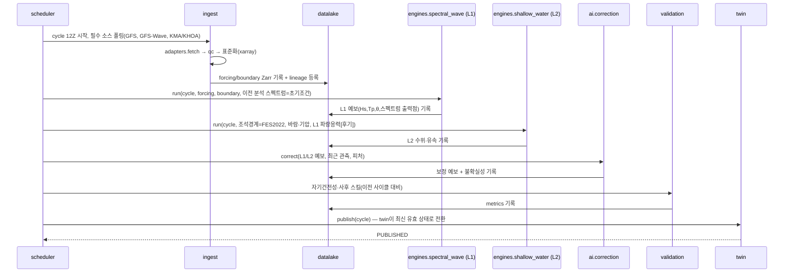
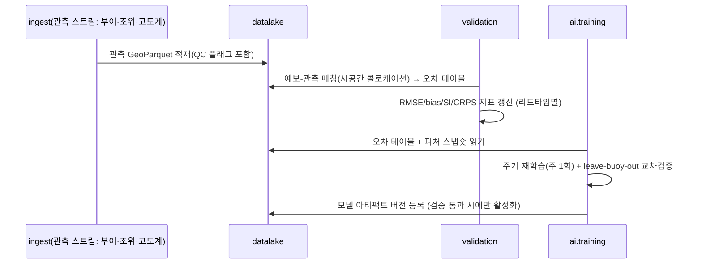
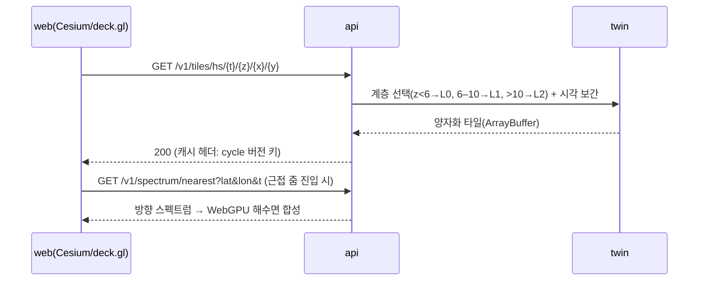

# Project Poseidon — Phase 2: Architecture (아키텍처 단계)

**문서 버전:** 1.0 · **작성일:** 2026-08-04 · **상태:** Phase 2 산출물
**선행:** [PHASE1_RESEARCH.md](PHASE1_RESEARCH.md), [PHASE1_DATA_CATALOG.md](PHASE1_DATA_CATALOG.md)
**결정 기록:** [ADR-001](adr/ADR-001-language-gpu-stack.md) 언어·GPU 스택 · [ADR-002](adr/ADR-002-grid-system.md) 격자 · [ADR-003](adr/ADR-003-data-lake-layout.md) 데이터 레이크 · [ADR-004](adr/ADR-004-forecast-cycle-state-machine.md) 사이클 상태기계 · [ADR-005](adr/ADR-005-frontend-rendering.md) 렌더링 · [ADR-006](adr/ADR-006-repository-structure.md) 저장소 구조(G-1 병합)

---

## 1. 과학적 설명 — 아키텍처가 물리를 따르는 이유

시스템 분해는 물리적 시간규모 분해를 그대로 따른다:

- **강제장(대기)** 은 우리가 계산하지 않고 소비한다 → `ingest`는 물리 엔진과 완전 분리.
- **파랑(초 단위 물리, 시간 단위 예측성)** 과 **조석·해일(시간 단위 물리)** 은 서로 다른 방정식·시간간격을 가지므로 별도 엔진으로 두고, 결합은 약결합(파랑이 해류·수위를 입력으로 받는 단방향, 사이클당 1회 갱신)으로 시작한다. 강결합(파랑응력→해일)은 Phase 6 확장점으로 인터페이스에만 반영해 둔다.
- **AI 보정** 은 물리 상태를 바꾸지 않고 산출물을 후처리한다 → 물리 엔진의 검증 가능성이 오염되지 않는다. 이는 운영기관의 MOS 전통과 동일한 분리 원칙이다.
- **디지털 트윈 상태** 는 "가장 최근 분석장 + 유효한 예보들"의 시간축 합성이며, `twin` 모듈만이 계층(L0/L1/L2) 블렌딩 규칙을 안다. API·시각화는 twin을 통해서만 상태를 조회한다.

## 2. 연구 참고문헌 (Phase 2 추가분)

1. Tolman, H.L. (2002). "Alleviating the Garden Sprinkler Effect in wind wave models." *Ocean Modelling*, 4, 269–289 — 이산 방향 스펙트럼 전파 아티팩트와 대응.
2. Hersbach, H., Janssen, P.A.E.M. (1999). "Improvement of the Short-Fetch Behavior in the Wave Ocean Model (WAM)." *J. Atmos. Oceanic Technol.*, 16, 884–892 — 소스항 준음해적 적분·성장 제한자.
3. Leonard, B.P. (1991). "The ULTIMATE conservative difference scheme applied to unsteady one-dimensional advection." *Comput. Methods Appl. Mech. Eng.*, 88, 17–74 — WW3의 UQ/UNO 계열 이류 기법 기초.
4. Gottlieb, S., Shu, C.-W., Tadmor, E. (2001). "Strong Stability-Preserving High-Order Time Discretization Methods." *SIAM Review*, 43, 89–112 — SSP-RK2/3.
5. Kurganov, A., Petrova, G. (2007). *Commun. Math. Sci.*, 5, 133–160 — SWE central-upwind (Phase 1 §2-24 재인용, L2 엔진의 주 기법).
6. Sielecki, A., Wurtele, M. (1970) 및 Stelling, G., Duinmeijer, S.P.A. (2003). "A staggered conservative scheme for every Froude number in rapidly varied shallow water flows." *Int. J. Numer. Meth. Fluids*, 43, 1329–1354 — wetting/drying 대안 기법.
7. OpenAPI Initiative (2021). *OpenAPI Specification v3.1.0.*
8. Miles, J., Zarr Development Team (2020–). *Zarr storage specification v3.*

## 3. 아키텍처 — 컴포넌트와 시퀀스

### 3.1 컴포넌트 의존 규칙 (위 → 아래 단방향 의존만 허용)

```
web ──► api ──► twin ──► datalake ◄── validation
                 │           ▲
scheduler ───────┼───────────┤ (상태기계가 전 단계를 구동)
                 ▼           │
        engines / ai / assimilation ──► physics(공통 수치)
                 ▲
              ingest(adapters→qc→sync) ──► datalake
```
`core`(타입·설정·카탈로그)는 전 모듈이 의존 가능. 역방향 의존(예: engines→api)은 CI의 임포트 린트로 차단한다.

### 3.2 시퀀스 — 예보 사이클 (ADR-004 상태기계의 정상 경로)



### 3.3 시퀀스 — 관측 검증·학습 루프 (사이클과 비동기)



### 3.4 시퀀스 — 사용자 조회 (줌 인)



### 3.5 모듈 인터페이스 (타입 시그니처 수준 — 구현은 Phase 3+)

```python
# poseidon/core/types.py
@dataclass(frozen=True)
class Cycle:      t0: datetime; kind: Literal["00","06","12","18"]
@dataclass(frozen=True)
class BBox:       west: float; south: float; east: float; north: float
@dataclass(frozen=True)
class Domain:     name: str; grid: "Grid"; level: Literal["L1","L2"]

# poseidon/ingest/adapters/base.py
class SourceAdapter(Protocol):
    source_id: ClassVar[str]
    tier: ClassVar[int]
    async def available(self, cycle: Cycle) -> bool: ...
    async def fetch(self, cycle: Cycle, bbox: BBox) -> xr.Dataset:
        """표준화 규약: CF 변수명, 시간축 UTC, 좌표 오름차순, lineage attrs 필수."""

# poseidon/ingest/qc/base.py
class QCCheck(Protocol):
    def apply(self, ds: xr.Dataset) -> xr.Dataset: ...   # qc_flag 변수 부여, 원값 불변

# poseidon/engines/base.py
class Engine(Protocol):
    def initialize(self, domain: Domain, ic: State, forcing: Forcing) -> EngineState: ...
    def step(self, s: EngineState, dt: float) -> EngineState: ...        # 순수함수(JAX jit 대상)
    def run(self, s: EngineState, until: datetime,
            outputs: OutputSpec) -> Iterator[StateSnapshot]: ...

class BoundaryProvider(Protocol):
    def boundary(self, domain: Domain, t: datetime) -> BoundaryState: ...  # L0→L1→L2 단방향

# poseidon/assimilation/base.py
class Assimilator(Protocol):
    def analyze(self, background: EnsembleState, obs: ObsBatch,
                H: ObsOperator) -> EnsembleState: ...

# poseidon/ai/correction/base.py
class Corrector(Protocol):
    version: ClassVar[str]
    def correct(self, forecast: xr.Dataset, features: xr.Dataset) -> CorrectedForecast: ...
    # CorrectedForecast = 보정값 + 예측구간(q05,q50,q95) + 적용여부 플래그

# poseidon/twin/store.py
class TwinStore(Protocol):
    def state_at(self, t: datetime, bbox: BBox, level: str) -> xr.Dataset: ...
    def point_forecast(self, lat: float, lon: float,
                       horizons: Sequence[timedelta]) -> PointForecast: ...
    def publish(self, run_id: UUID) -> None: ...
```

## 4. 폴더 구조

ADR-006에서 확정 (G-1 채택분: `ingest/qc`, `validation` 승격, `notebooks` 3분류, `web/src` 구획, `scripts`; 기각분: terraform/helm/argocd, kafka/airflow, swan_core/roms_core, wrf_subsystem). 본 Phase에서 골격과 모듈별 README를 실제 생성한다.

## 5. 마일스톤 (Phase 2 완료 기준)

- [x] ADR 6건 작성
- [x] 모듈 인터페이스 타입 시그니처 정의 (§3.5)
- [x] 시퀀스 다이어그램 3종 (§3.2–3.4)
- [x] OpenAPI 3.1 초안 — [api/openapi.yaml](api/openapi.yaml)
- [x] DB 스키마 v2 — [db/schema.sql](db/schema.sql)
- [x] 수치 설계서 (§7 — 이산화·시간적분·CFL)
- [x] 개발 환경·CI 정의 (§10) + 저장소 골격 생성
- [ ] 사용자 승인 → Phase 3 진입

## 6. 구현 계획 (Phase 3 준비 관점)

Phase 3(데이터 파이프라인)의 착수 순서를 여기서 고정한다:
1. `core`(타입·설정·카탈로그) → 2. `ingest/adapters`의 **GFS·GFS-Wave·NDBC·KMA·KHOA** 5종 (Tier 0) → 3. `qc` 기본 검사(범위·스파이크·정체) → 4. `datalake`(Zarr 기록+lineage) → 5. `scheduler`의 INGESTING 경로만으로 **24h 무인 수집 운전**(M3). 정적 데이터(GEBCO·OSM·FES2022)는 `scripts/fetch_sample_data`로 일괄 확보.

## 7. 수치 설계서 (엔진 이산화 확정)

### 7.1 스펙트럼 파랑 엔진 (L1)

**분할(fractional step) 전략** — WW3와 동일하게 연산자 분할:
```
N^{n+1} = S_src∘T_θk∘T_xy (N^n)
```
1. **지리 전파 T_xy:** 구면 위경도 격자, 보존형 플럭스, 1차 상향(초기) → UNO2(Leonard ULTIMATE 계열, 2차·단조) 승급. Garden-sprinkler 완화는 방향 36개 유지 + (필요시) Booij-Holthuijsen 확산 보정.
2. **스펙트럼 공간 전파 T_θk:** 굴절(θ̇)·천수화(k̇) — 1차 상향, 방향은 주기 경계.
3. **소스항 S_src:** ST4 계열(S_in Ardhuin 2010, S_ds 포화 기반, S_nl DIA, S_bot JONSWAP, S_db Battjes-Janssen). **준음해적 적분**(WAM 4 방식, Hersbach-Janssen 1999): ΔN = S·Δt/(1−α·D·Δt), D=∂S/∂N 대각 근사, 성장 제한자 병용.

**CFL 조건 (설계 수치):** 동아시아 0.05° 격자에서 최악 조건은 최저주파수(f₀=0.035 Hz) 심수 군속도
c_g = g/(4πf₀) ≈ 22.3 m/s. 40°N에서 경도 격자간격 ≈ 4.26 km →
**Δt_xy ≤ 4260/22.3 ≈ 191 s → 전파 Δt = 150 s 채택** (전지구 확장 시 위도별 분할 스텝 또는 고위도 필터 필요 — Phase 9).
소스항 Δt는 동적 제한자(스펙트럼 변화율 기준, 최소 15 s)로 서브사이클.

**상태 배열:** `N[ny, nx, 36, 32]` fp32 ≈ 700×700×36×32×4 B ≈ **2.3 GB** — 단일 GPU(≥16 GB) 여유. 72 h/150 s = 1728 스텝.

### 7.2 천수방정식 엔진 (L2)

- **공간:** Kurganov–Petrova central-upwind FVM, MUSCL 2차 재구성(minmod), **정수압 재구성**(Audusse 2004)으로 well-balanced(정지호수 기계정밀도) + 양수보존.
- **시간:** SSP-RK2 (Gottlieb et al. 2001). **마찰항은 반음해적**(박수층 강성 회피): 운동량 갱신 후 `u^{n+1} = u*/(1+Δt·C_f|u*|/h)`.
- **코리올리:** 회전 행렬 정확 적분(스텝 분할)로 관성진동 에너지 보존.
- **wetting/drying:** 최소수심 h_dry = 10⁻³ m 마스크 + KP 기법의 양수보존 성질 활용. 검증: Thacker 진동 해석해.
- **조석 강제:** 개방경계 FES2022 조화합성(주요 16분조) + 영역 내 평형조석 퍼텐셜(장주기 정확도). 경계 반사 억제: Flather 방사 조건.
- **CFL:** Δt ≤ CFL·min(Δx/(|u|+√(gh))), CFL=0.45. 예: 동해 해일 도메인 500 m, h_max≈3700 m → √(gh)≈190 m/s → **Δt ≈ 1.2 s**. 항만 도메인 50 m, h≈30 m → Δt ≈ 1.3 s (영역이 작아 총비용 미미).

### 7.3 계층 결합 규약
- L0→L1: GFS-Wave 경계 스펙트럼(JONSWAP 재구성: Hs,Tp,θ,확산) — 완전 스펙트럼 경계는 IFREMER 소스 확보 시 승급.
- L1→L2: 파랑응력·radiation stress는 **Phase 6 확장점** — 인터페이스(`BoundaryProvider`)에 자리만 예약, 초기엔 조석+기상 강제만.
- 시각화 계층 선택: 줌 z<6 → L0, 6≤z≤10 → L1, z>10 → L2 (twin이 중재, §3.4).

### 7.4 정밀도·보존 정책 (ADR-001)
상태 fp32, 시간 누적량(질량·에너지 감사)은 fp64 별도 누산. 과학 테스트가 매 릴리스에서 보존 오차 상한을 검사한다.

## 8. API 사양

[docs/api/openapi.yaml](api/openapi.yaml) — OpenAPI 3.1 초안 확정. Phase 1 §8의 경로를 스키마 수준으로 구체화 (PointForecast에 예측구간 q05/q50/q95와 `corrected` 플래그 포함 — AI 보정 투명성 원칙).

## 9. 데이터베이스 스키마

[docs/db/schema.sql](db/schema.sql) — v2로 확정. Phase 1 초안 대비 추가: `dataset`(lineage 카탈로그), `cycle_event`(상태기계 감사 로그), `model_artifact`(AI 모델 버전·활성화), `alert`.

## 10. 테스트 전략·개발 환경·CI

- **도구:** `ruff`(lint+format), `mypy --strict`, `pytest`(마커: `unit|scientific|integration|benchmark`), `hypothesis`(속성 테스트 — 예: QC는 원값 불변).
- **CI (GitHub Actions):** push마다 lint+type+unit, nightly로 scientific+integration(외부 네트워크 필요 테스트는 nightly 전용), 벤치마크는 회귀 비교 리포트.
- **임포트 경계 검사:** §3.1 의존 규칙을 `ruff` 커스텀 룰(또는 import-linter)로 강제.
- **NumPy↔JAX 일치 테스트:** 동일 초기조건 1000스텝 후 상대오차 < 1e-5 (fp32 누적 감안한 상한, 케이스별 문서화).
- 파이썬 3.12, `uv`로 의존성 잠금. 골격에 `pyproject.toml`·CI 워크플로 포함.

## 11. 성능 목표

Phase 1 §11 유지 + 수치 설계로부터의 구체화: L1 1스텝(전파+소스, 700×700×36×32)을 GPU에서 **≤ 300 ms** (1728스텝×0.3 s ≈ 8.6분 < 목표 10분). 초과 시 최적화 순서: 소스항 커널 융합 → 전파 방향 배치화 → fp16 혼합정밀 검토(보존 감사 통과 조건).

## 12. 리스크 분석 (Phase 2 신규)

| 리스크 | 대응 |
|---|---|
| JAX에서 준음해적 소스 적분의 수치 안정성(제한자 튜닝) | NumPy 참조로 학술 성장곡선 재현을 먼저 통과시킨 후 포팅 (M5 게이트) |
| 모놀리스가 커지며 모듈 경계 침식 | §3.1 임포트 린트 CI 강제, ADR-006 경계 README |
| Cesium+deck.gl 인터롭 카메라 동기화 이슈 | Phase 8 첫 주에 스파이크(기술 검증) 태스크 배정, 실패 시 deck.gl GlobeView 단독 폴백 |
| DIA 구현 난도(Phase 1 리스크 재확인) | WW3 매뉴얼 검증 케이스 + IFREMER 스펙트럼과 직접 대조 |

## 13. 다음 단계: Phase 3 — Data Pipeline

산출물: Tier 0 어댑터 5종(GFS, GFS-Wave, NDBC, KMA, KHOA) 구현 + QC + Zarr 데이터 레이크 + INGESTING 상태기계 경로 + **24시간 무인 수집 운전 증명(M3)**. 진입 조건: 본 문서·ADR 승인 + 사용자 계정 발급(카탈로그 §J — 최소 KMA API허브·KHOA 2건 선행).
